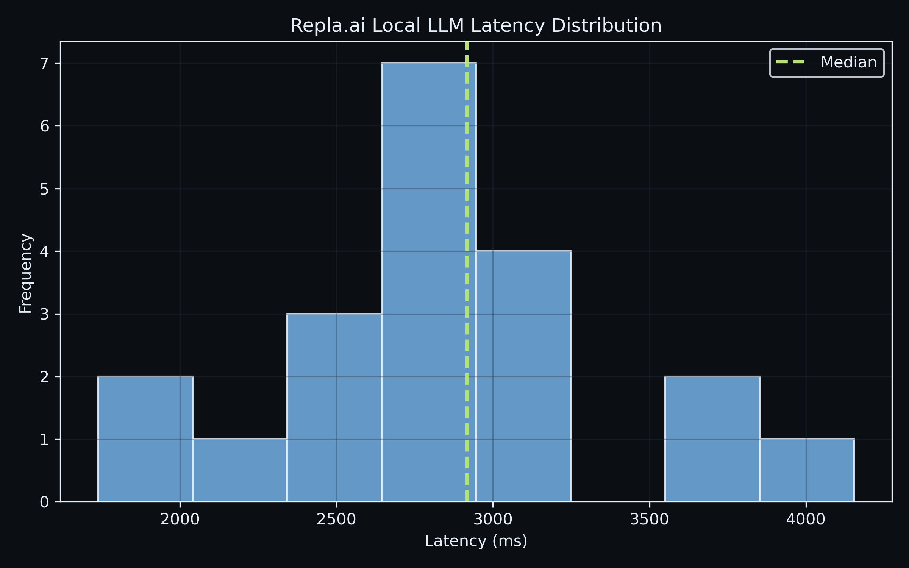
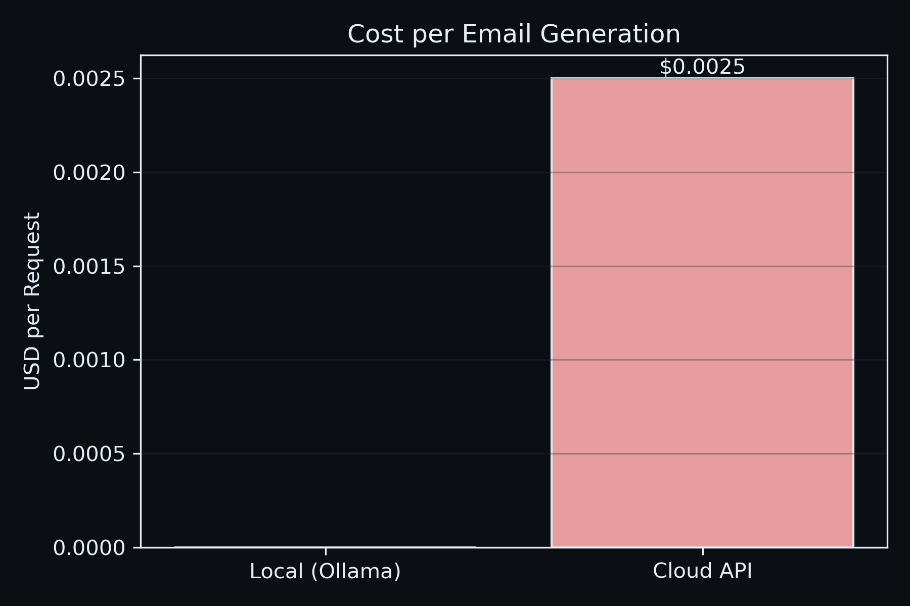
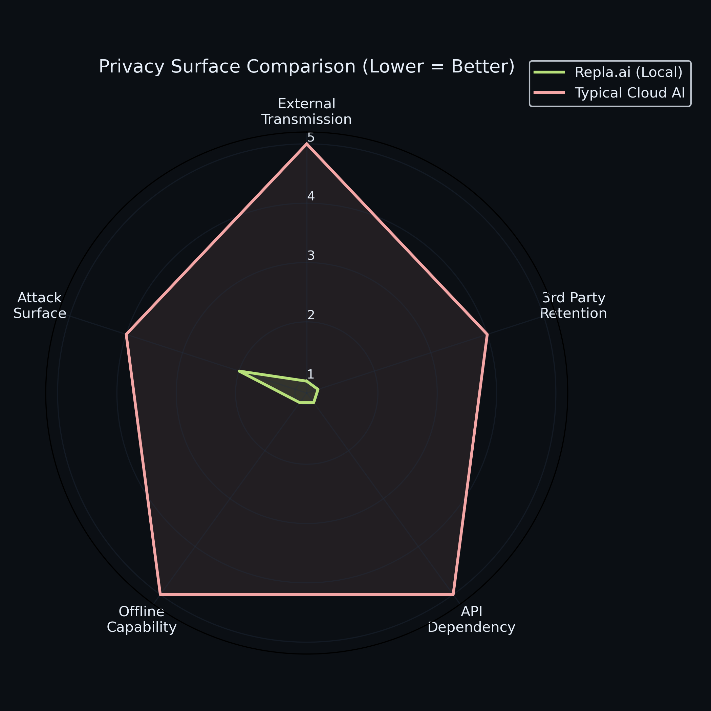

  

<h1 align="center">Repla.ai</h1>

  Privacy-first AI Gmail assistant powered by a local LLM (Ollama + Llama 3.1)

  Applied AI Systems Project — Chrome Extension × Local LLM × Lightweight API Architecture

---

## 🧠 Overview

Repla.ai is a privacy-first AI email assistant that generates contextual Gmail replies using a locally running Large Language Model (Llama 3.1 via Ollama).

Unlike cloud-based AI assistants, **all inference happens locally**:

Gmail → Chrome Extension → Local Express API → Ollama (Llama 3.1) → Draft injected back into Gmail

This project explores:

- Applied LLM integration in real user workflows  
- Local inference vs cloud trade-offs  
- Lightweight API orchestration  
- Prompt conditioning for controlled generation  
- UX + ML system design  

---

## 🎯 Problem Statement

Modern AI email tools rely on cloud APIs, raising:

- Privacy concerns  
- Data compliance issues  
- API cost constraints  
- Latency variability  

Repla.ai investigates whether a **fully local LLM pipeline** can deliver useful productivity gains while maintaining complete data privacy.

---

## 🏗️ System Architecture

Gmail UI (Chrome)
↓
Content Script (Extract Email)
↓
Background Service Worker
↓
Local Express API (Node.js)
↓
Ollama Runtime
↓
Llama 3.1 (Local LLM Inference)
↓
Generated Reply → Injected Back into Gmail

### Architectural Principles

- **Local-first inference** (No external API calls)
- **Stateless backend orchestration**
- **Prompt conditioning via tone control**
- **Modular separation of UI, API, and model layers**
- **Zero data persistence**

---

## 🔬 Design Comparison

| Feature | Repla.ai | Typical Cloud AI Email Tools |
|----------|-----------|-----------------------------|
| Data Processing | Fully Local | Cloud-based |
| LLM Hosting | Ollama (local) | OpenAI / API |
| Cost per request | $0 | API usage cost |
| Privacy Risk | Minimal | High (external servers) |
| Latency | Device dependent | Network dependent |
| Offline Usage | Yes | No |

---

## 📊 Quantitative Evaluation

### 📈 Local Inference Latency Distribution

We benchmarked end-to-end local inference latency
(Gmail → Extension → Local API → Ollama → Response).

- Trials: 20
- Median latency: 2.9s
- P95 latency: 4.1s
- Environment: MacBook + Ollama (Llama 3.1 local)

---

### 💰 Cost Comparison (Per Email)

Assumptions:
- Avg tokens per request: ~500
- Cloud API pricing: $5 per 1M tokens
- Local inference: $0 API cost

---

### 🔐 Privacy Surface Comparison (Lower = Better)

We score privacy exposure on a 1–5 scale (1 = low risk, 5 = high risk) across:
- External data transmission
- Third-party retention
- API dependency
- Offline capability
- Attack surface

---

## 🧪 Evaluation Methodology

**Latency**
- N = 20 trials
- Median + P95 reported (robust to outliers)
- Measured end-to-end: Extension → Express API → Ollama → Response

**Cost Model**
- Estimated 500 tokens per email (350 input + 150 output)
- Cloud pricing: $5 / 1M tokens (configurable)
- Local inference API cost: $0

**Privacy Scoring**
- 5-dimensional rubric
- 1–5 scale (1 = low exposure, 5 = high exposure)
- Compared local-first vs typical cloud AI architecture

All evaluation scripts are included in `/eval` for reproducibility.
